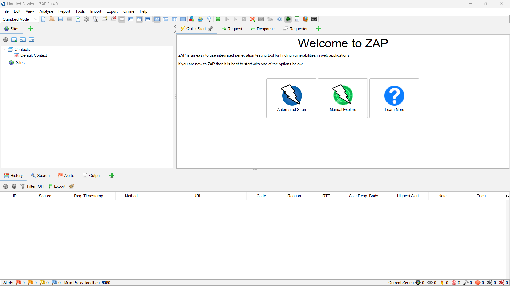

# Workshop ZAP 
TODOLIST: 
1 ✅ zap installatie --> Installeren van ZAP plus benodigdheden  
2 ☑️ spider --> Uitleggen wat de spider is en hoe deze gebruikt kan worden.  
3 ✅ ajax spider --> Uitleggen wat het verschil is tussen de normale spider en de ajax spider en hoe deze gebruikt kan worden.  
4 active scan --> Uitleggen wat een active scan is en hoe je deze kan uitvoeren.   
    --> Scan op broken acces control. Eerst ajax spider uitvoeren met admin account en dan active scan uitvoeren met not admin.  
5 analyse found issues --> Als je met de tools issues hebt gevonden, hoe analyseer je die.  
    5a Vastleggen nulmeting.
6 edit request --> Een eerder gemaakt request wijzigen en kijken wat hier de resultaten van zijn.  
7 import/export/report --> Hoe kun je de gevonden informatie exporteren en hier een rapport van genereren?   

## Voorwaarden deelname
Geen

## Beschrijving 
TODO: Beschrijving ZAP

## Eindresultaat
Na het afronden van de workshop beschik je over het volgende eindresultaat:
TODO

## Opdracht 1: Setup 
Voordat we kunnen beginnen met pentesting, moeten we ZAP en de benodigde software installeren. Volg de onderstaande stappen: 

**Stap 1:** ZAP maakt gebruik van JAVA, als dit nog niet op je computer staat kun je dit <a href="https://www.oracle.com/java/technologies/downloads/" target="_blank">hier downloaden</a>. *Let op: Zap vereist minimaal JAVA versie 11.*

**Stap 2:** Download ZAP via <a href="https://www.zaproxy.org/download/" target="_blank">deze link</a>.

**Stap 3:** Volg de instructies in de setup.

**Stap 4:** Start ZAP.

*Als je alle stappen correct hebt doorlopen, zie je het volgende: * 

**✔️ opdracht 1 is klaar!**
## Opdracht 2: 🕷 Spider
We gaan starten met het in kaart brengen van je website, dit gaan we doen met een spider. Dit is een tool die automatisch nieuwe resources (URLs) ontdekt. De spider begint met een lijst aan URLs om te bezoeken en gaat van daaruit nieuwe hyperlinks opzoeken en voegt deze toe aan de lijst. Hij blijft doorgaan tot alle URLs in de lijst bezocht zijn.

### Opstarten Spider
**Stap 1:** Launch je eigen webapplicatie lokaal. Onthoud of noteer de URL (Bijvoorbeeld: https://localhost:7095/).

**Stap 2:** In ZAP, klik onderaan in de toolbar op de groene plus.

**Stap 3:** Selecteer *🕷 Spider*.

**Stap 4:** Klik op *🕷 New Scan*.

### Instellen scope
Om ervoor te zorgen dat de spider alleen op jouw webapplicatie blijft, moet eerst de scope ingesteld worden. Dit voorkomt dat ZAP andere websites scant of aanvalt.

**Stap 5:** In het veld *Starting point* vul je de URL van je eigen applicatie in die je bij stap 1 hebt genoteerd. **⚠️Let op: Gebruik ZAP alleen op applicaties waar je de eigenaar van bent, of waar je toestemming voor hebt. ZAP simuleert een echte aanval en kan echte schade aanrichten aan websites. ⚠️**

**Stap 6:** De context kan leeg blijven, dan wordt de standaard context gebruikt. De andere opties kunnen blijven zoals ze zijn. !TODO: We gaan later een eigen context aanmaken.

**Stap 7:** Klik op *Start Scan*.

### Resultaten spiderscan.
De lijst met URLs wordt nu gevuld. Bij elke URL staat de volgende informatie: 
- **Processed** - Of the URL was verwerkt door de spider of was overgeslagen. (Bijvoorbeeld buiten de scope)
- **Method** - De gebruikte HTTP methode, bijvoorbeeld **GET** of **POST**.
- **URL** - De gevonden resource.
- **Flags** - Extra informatie over de URL.

**Stap 8:** Aan de zijkant staat het tabje 🌍*Sites*. Als je de folder met URL van je webapplicatie uiteenklapt, zie je een folder structuur. Komt deze structuur (gedeeltelijk) overeen met de folderstructuur in je editor? Mis je nog een aantal folders/resources? Zie je bestanden die je er niet tussen wilt zien? Denk aan admin pagina's, pagina's die je alleen mag zien als je ingelogd bent of andere resources. Zie je onverwachte folders of items? Noteer deze dan.

**Stap 9:** In de toolbar onderaan staat een tabje 🚩*Alerts*. In dit tabje kun je zien welke security issues de spiderscan heeft gevonden. Bekijk de alerts, kies een aantal uit die je wil gaan oplossen. TODO: Moet hier nog een bepaald aantal opgelost worden, hoe moet dit genoteerd worden in het portfolio? 

**✔️ Opdracht 2 is klaar!**
## Opdracht 3: 🕷️Ajax spider
De Ajax spider gebruikt een andere methode dan de normale spider om URLs te vinden. Deze spider is bedoeld voor sites die veel gebruik maken van AJAX (Asynchronous JavaScript and XML <a href="https://en.wikipedia.org/wiki/Ajax_(programming)" target="_blank">Wikipedia</a>). Omdat deze spider een andere methode gebruikt, kan deze ook andere URLs vinden. Het starten van de Ajax spider is vergelijkbaar met de normale spider.

### Opstarten Spider
**Stap 1:** Launch je eigen webapplicatie lokaal. Onthoud of noteer de URL (Bijvoorbeeld: https://localhost:7095/).

**Stap 2:** In ZAP, klik onderaan in de toolbar op de groene plus.

**Stap 3:** Selecteer *🕷 Ajax spider*.

**Stap 4:** Klik op *🕷 New Scan*.

**Stap 5:** In het veld *Starting point* vul je de URL van je eigen applicatie in die je bij stap 1 hebt genoteerd. **⚠️Let op: Gebruik ZAP alleen op applicaties waar je de eigenaar van bent, of waar je toestemming voor hebt. ZAP simuleert een echte aanval en kan echte schade aanrichten aan websites. ⚠️**

**Stap 6:** De context kan leeg blijven, dan wordt de standaard context gebruikt.

**Stap 7:** Zorg ervoor dat je bij het selecteren van een browser een *Headless* variant kiest. Anders worden er tientallen instanties van je browser geopend. 

**Stap 8:** Klik op *Start Scan*. De AJAX spider kan langer duren dan de normale spider.

### Resultaten spiderscan.
De lijst met URLs wordt nu gevuld. Bij elke URL staat de volgende informatie: 
- **Processed** - Of the URL was verwerkt door de spider of was overgeslagen. (Bijvoorbeeld buiten de scope)
- **Method** - De gebruikte HTTP methode, bijvoorbeeld **GET** of **POST**.
- **URL** - De gevonden resource.
- **Size Resp. Header en Size Resp. Body** - De grootte van de response header en body.

Je folder structuur is nu groter geworden, je ziet meer pagina's en andere resources in het 🌍*Sites* tabje. 
We hebben nu je webapplicatie in kaart gebracht. 

**✔️ opdracht 3 is klaar!**
## Opdracht 4: 🔥Active Scan
We hebben nu aan de hand van spiders je webapplicatie in kaart gebracht. Nu is het tijd om de gevonden pagina's aan te vallen.

**⚠️Let op: De volgende stappen kunnen schade toebrengen aan je applicatie en database. Het kan zijn dat je data uit je database verliest. Als er data in je database zit, die er niet via seeding in is gekomen, zorg er dan voor dat je een kopie van je database hebt.⚠️**

De active scan probeert verschillende bekende aanvallen tegen de geselecteerde doelen. Je kunt zelf instellen welke aanvallen extra vaak uitgevoerd worden en welke waarden deze krijgen. Standaard zijn deze instellingen goede genoeg voor het uitvoeren van de active scan.

**Stap 1:** In het 🌍*Sites* tabje, klik met je rechtermuis op de 📄*GET:/* pagina en selecteer *Attack* --> 🔥*Active scan*.

**Stap 2:** Klik op *Start Scan*.

Er wordt nu een scan uitgevoerd op de pagina's die gevonden zijn met de spiders.

**Stap 3:** Omdat deze scan iets langer kan duren, voornamelijk voor grote websites, is het mogelijk om specifiekere voortgang in te zien. In het 🔥*Active Scan* tabje dat nu is geopend, klik op het 📟*Progress details* icoontje naast de ⏸️*Pauze* en ⏹️*Stop* knop.

In het venster dat nu geopend wordt, zie je welke attacks uitgevoerd worden en hoever de attacks zijn. Hier wordt getoond hoeveel requests voor die attack zijn uitgevoerd en hoeveel van deze requests een alert opleveren.

### Active scan met gebruikers-rechten
We hebben nu een scan uitgevoerd vanuit het perspectief van en niet-ingelogde gebruiker. Je hebt in je eigen applicatie aan de hand van Identity (of op een andere manier) authenticatie en authorizatie geïmplementeerd. ZAP kan ook werken vanuit een ingelogde gebruiker. We gaan nu een scan uitvoeren vanuit een standaard ingelogde gebruiker.

**Stap 4:** We gaan aan de default context een gebruiker toevoegen, eerst moeten we een context toevoegen. In het 🌍*Sites* tabje, klik met je rechtermuis op de 📄*https://localhost:XXXX* folder en selecteer *Include in context* --> *Default context*.

## Vandaag voltooide taken
- 🗺️ Website in kaart gebracht met verschillende spiders.
- 🔥 Active scan uitgevoerd als niet-ingelogde gebruiker en ingelogde gebruiker.